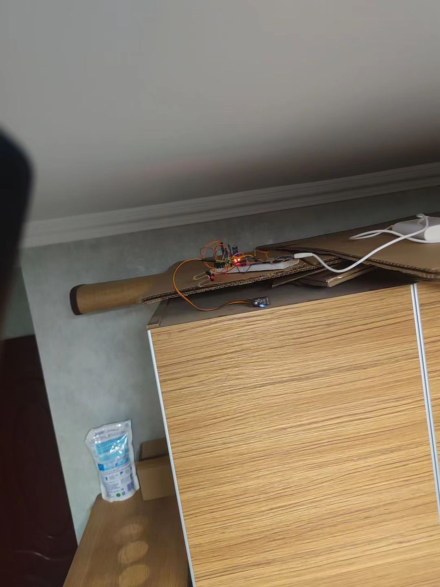
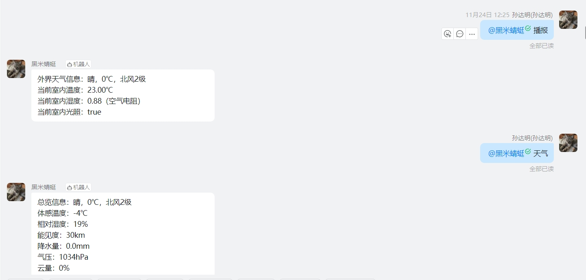

# HomeHolder-DingBot
### 钉钉机器人家庭管理：控制温湿度、开关灯等
#### 一、简介
- 本项目是基于钉钉机器人的家庭管理系统，可以通过钉钉机器人控制温湿度、开关灯等
- 理论上可以通过修改代码添加包括自制硬件以外所有智能家居硬件设备和开关
- 根本原理就是使用内网的服务器向内网的联网设备发送交互请求，然后设备执行相应的操作
- 可单聊和群聊触发，群聊的时候需要@机器人（使用之前需要配置好机器人在群中的ASSESS_TOKEN）

接线图

放置图

聊天交互

#### 二、软件部分
- 本项目使用Python3.10开发，使用了Flask框架与钉钉机器人进行交互
- 使用时可以修改代码中的属性值或者使用代码中的dockerfile构建镜像进行启动
- 必要环境变量有（默认没修改代码的情况下）：
    - HARD_SERVER：自建硬件的服务地址
    - LOCATION_CODE：获取天气使用的城市代码
    - HEFENG_KEY：获取天气使用的和风天气应用key
    - SECRET：钉钉机器人的app_secret
    - ASSESS_TOKEN：机器人服务的钉钉群的ASSESS_TOKEN

#### 三、硬件部分
- 本项目演示使用的硬件是自己DIY的，使用的是ESP8266芯片
- 能操控的硬件参考https://github.com/tyza66/GreenBelt 项目中的硬件，只是在D5口添加了一个用于控制灯开关的舵机控制信号

#### 四、结论与效果
- 好用，但是灯开关那块的舵机需要粘贴牢固，角度要调好
- 其他物联网设备接入的时候需要修改代码，理论上可以接入所有的WIFI或者直接联网的物联网设备

By：tyza66
